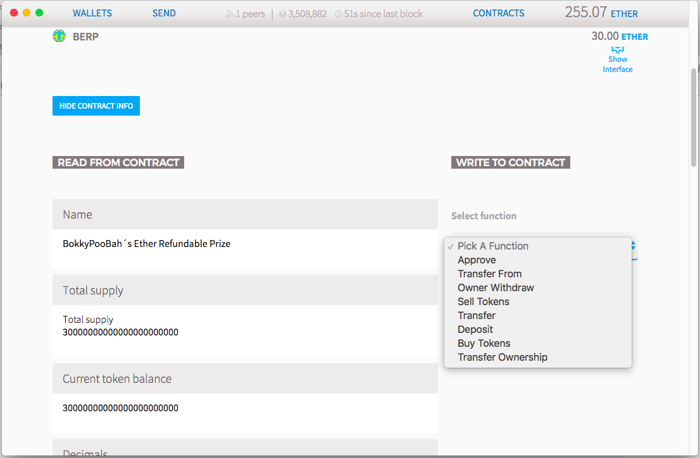

# BokkyPooBah's Ether Refundable Prize

A gift token backed by ethers. 

The [BokkyPooBahsEtherRefundablePrize.sol](https://github.com/bokkypoobah/BokkyPooBahsEtherRefundablePrize/blob/d54b38150ca8c5623bc9786f298421552cf2b861/contract/BokkyPooBahsEtherRefundablePrize.sol) contract has been deployed to [0xed7da010027967365e0a7c370c1dde2f9fe4477f](https://etherscan.io/address/0xed7da010027967365e0a7c370c1dde2f9fe4477f) at 02:54:00 Mon April 10 2017  UTC (Unix timestamp 1491792840).

These tokens can be bought from this contract at the Buy Price.

These tokens can be sold back to this contract at the Sell Price. Ethers backing the outstanding tokens are locked in the token contract.

    Period                                ETH per BERP
    ------------------------- ------------------------
    From         To               Buy Price Sell Price
    ------------ ------------ ------------- ----------
    start        +7 days             0.0010     0.0010
    +7 days      +30 days            0.0011     0.0010
    +30 days     +60 days            0.0012     0.0010
    +60 days     +90 days            0.0013     0.0010
    +90 days     +365 days           0.0015     0.0010
    +365 days    forever          1000.0000     0.0010

You may find higher or lower prices for these tokens at [https://cryptoderivatives.market/token/BERP](https://cryptoderivatives.market/token/BERP).

 

### How To Buy BERP Tokens

Just send ETH to the BERP contract at [0xed7da010027967365e0a7c370c1dde2f9fe4477f](https://etherscan.io/address/0xed7da010027967365e0a7c370c1dde2f9fe4477f) and BERP tokens will be deposited in your account. See the Buy Price above to calculate the number of BERP tokens you will receive.

To view the BERP tokens in Ethereum Wallet / Mist, Parity or MyEtherWallet, add a Watch Token at the address `0xed7da010027967365e0a7c370c1dde2f9fe4477f`.

 

### How To Sell BERP Tokens

Watch the BERP Token Contract in Ethereum Wallet / Mist, Parity or MyEtherWallet with the following information:

* Contract name: BERP
* Contract address: 0xed7da010027967365e0a7c370c1dde2f9fe4477f
* Copy the Application Binary Interface below and paste it into your JSON INTERFACE text box (or equivalent in Parity / MyEtherWallet):
  > [{"constant":true,"inputs":[],"name":"name","outputs":[{"name":"","type":"string"}],"payable":false,"type":"function"},{"constant":false,"inputs":[{"name":"_spender","type":"address"},{"name":"_amount","type":"uint256"}],"name":"approve","outputs":[{"name":"success","type":"bool"}],"payable":false,"type":"function"},{"constant":true,"inputs":[],"name":"totalSupply","outputs":[{"name":"totalSupply","type":"uint256"}],"payable":false,"type":"function"},{"constant":false,"inputs":[{"name":"_from","type":"address"},{"name":"_to","type":"address"},{"name":"_amount","type":"uint256"}],"name":"transferFrom","outputs":[{"name":"success","type":"bool"}],"payable":false,"type":"function"},{"constant":true,"inputs":[],"name":"currentTokenBalance","outputs":[{"name":"","type":"uint256"}],"payable":false,"type":"function"},{"constant":true,"inputs":[],"name":"decimals","outputs":[{"name":"","type":"uint8"}],"payable":false,"type":"function"},{"constant":false,"inputs":[{"name":"amount","type":"uint256"}],"name":"ownerWithdraw","outputs":[],"payable":false,"type":"function"},{"constant":true,"inputs":[{"name":"at","type":"uint256"}],"name":"buyPriceAt","outputs":[{"name":"","type":"uint256"}],"payable":false,"type":"function"},{"constant":true,"inputs":[],"name":"sellPrice","outputs":[{"name":"","type":"uint256"}],"payable":false,"type":"function"},{"constant":false,"inputs":[{"name":"amountOfTokens","type":"uint256"}],"name":"sellTokens","outputs":[],"payable":false,"type":"function"},{"constant":true,"inputs":[{"name":"_owner","type":"address"}],"name":"balanceOf","outputs":[{"name":"balance","type":"uint256"}],"payable":false,"type":"function"},{"constant":true,"inputs":[],"name":"buyPrice","outputs":[{"name":"","type":"uint256"}],"payable":false,"type":"function"},{"constant":true,"inputs":[],"name":"owner","outputs":[{"name":"","type":"address"}],"payable":false,"type":"function"},{"constant":true,"inputs":[],"name":"symbol","outputs":[{"name":"","type":"string"}],"payable":false,"type":"function"},{"constant":true,"inputs":[],"name":"amountOfEthersOwnerCanWithdraw","outputs":[{"name":"","type":"uint256"}],"payable":false,"type":"function"},{"constant":false,"inputs":[{"name":"_to","type":"address"},{"name":"_amount","type":"uint256"}],"name":"transfer","outputs":[{"name":"success","type":"bool"}],"payable":false,"type":"function"},{"constant":false,"inputs":[],"name":"deposit","outputs":[],"payable":true,"type":"function"},{"constant":false,"inputs":[],"name":"buyTokens","outputs":[],"payable":true,"type":"function"},{"constant":true,"inputs":[],"name":"currentEtherBalance","outputs":[{"name":"","type":"uint256"}],"payable":false,"type":"function"},{"constant":true,"inputs":[{"name":"_owner","type":"address"},{"name":"_spender","type":"address"}],"name":"allowance","outputs":[{"name":"remaining","type":"uint256"}],"payable":false,"type":"function"},{"constant":true,"inputs":[],"name":"deployedAt","outputs":[{"name":"","type":"uint256"}],"payable":false,"type":"function"},{"constant":false,"inputs":[{"name":"newOwner","type":"address"}],"name":"transferOwnership","outputs":[],"payable":false,"type":"function"},{"inputs":[],"payable":false,"type":"constructor"},{"payable":true,"type":"fallback"},{"anonymous":false,"inputs":[{"indexed":true,"name":"buyer","type":"address"},{"indexed":false,"name":"ethers","type":"uint256"},{"indexed":false,"name":"newEtherBalance","type":"uint256"},{"indexed":false,"name":"tokens","type":"uint256"},{"indexed":false,"name":"newTotalSupply","type":"uint256"},{"indexed":false,"name":"buyPrice","type":"uint256"}],"name":"TokensBought","type":"event"},{"anonymous":false,"inputs":[{"indexed":true,"name":"seller","type":"address"},{"indexed":false,"name":"ethers","type":"uint256"},{"indexed":false,"name":"newEtherBalance","type":"uint256"},{"indexed":false,"name":"tokens","type":"uint256"},{"indexed":false,"name":"newTotalSupply","type":"uint256"},{"indexed":false,"name":"sellPrice","type":"uint256"}],"name":"TokensSold","type":"event"},{"anonymous":false,"inputs":[{"indexed":false,"name":"amount","type":"uint256"},{"indexed":false,"name":"balance","type":"uint256"}],"name":"Deposited","type":"event"},{"anonymous":false,"inputs":[{"indexed":false,"name":"amount","type":"uint256"},{"indexed":false,"name":"remainingWithdrawal","type":"uint256"}],"name":"Withdrawn","type":"event"},{"anonymous":false,"inputs":[{"indexed":true,"name":"_from","type":"address"},{"indexed":true,"name":"_to","type":"address"},{"indexed":false,"name":"_value","type":"uint256"}],"name":"Transfer","type":"event"},{"anonymous":false,"inputs":[{"indexed":true,"name":"_owner","type":"address"},{"indexed":true,"name":"_spender","type":"address"},{"indexed":false,"name":"_value","type":"uint256"}],"name":"Approval","type":"event"},{"anonymous":false,"inputs":[{"indexed":true,"name":"_from","type":"address"},{"indexed":true,"name":"_to","type":"address"}],"name":"OwnershipTransferred","type":"event"}]

* Select the **Sell Tokens** option from the drop down as shown below:
  

 

### Testing And Results

The test cases can be found in [test/01_test1.sh](https://github.com/bokkypoobah/BokkyPooBahsEtherRefundablePrize/blob/d54b38150ca8c5623bc9786f298421552cf2b861/test/01_test1.sh) and the results from this test in [test/test1results.txt](https://github.com/bokkypoobah/BokkyPooBahsEtherRefundablePrize/blob/d54b38150ca8c5623bc9786f298421552cf2b861/test/test1results.txt).

Enjoy. (c) BokkyPooBah / Bok Consulting Pty Ltd 2017. The MIT Licence.